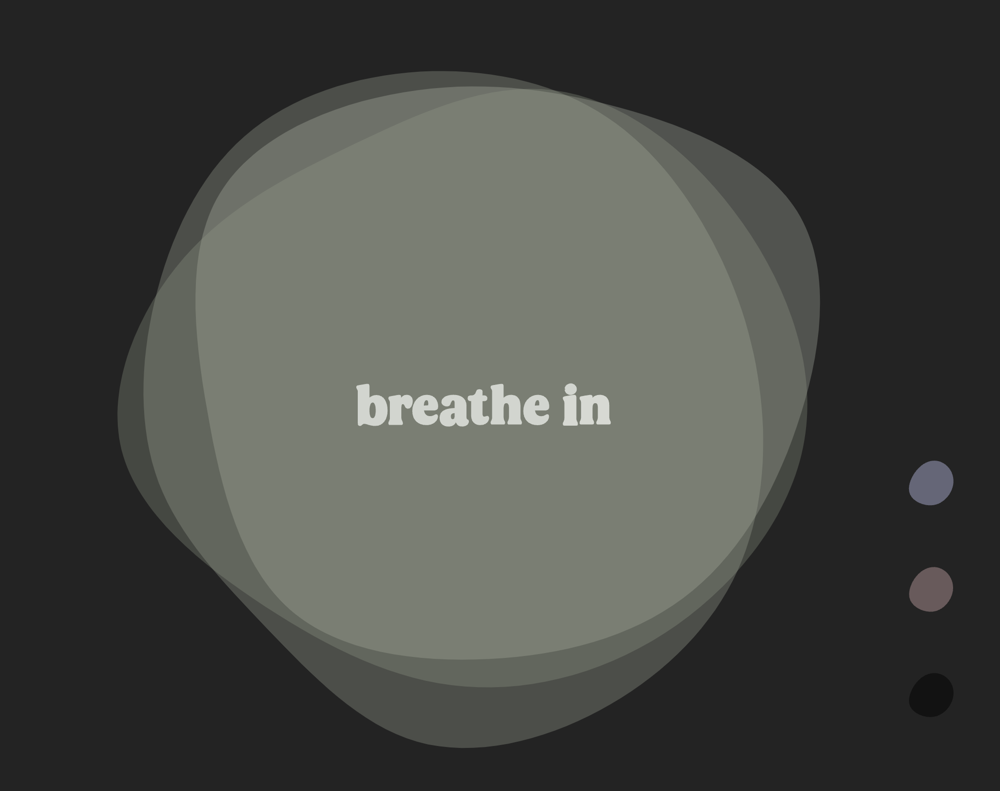
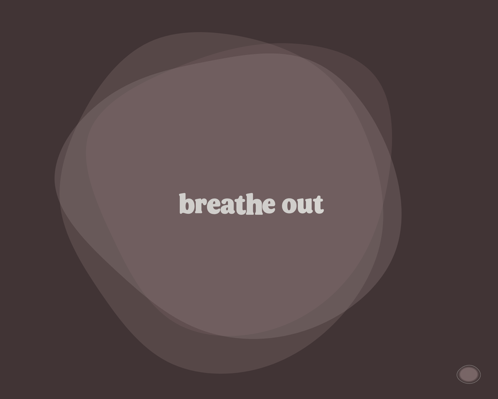

# SVG animation

This animation facilitates controlled breathing exercises, offering customizable color options to enhance relaxation according to your preferences. With organic movement and built-in randomness, the text aims to induce a calming effect.

## Link to live project

[Github Pages](olandstorm.github.io/SVGanimation/)

## Assignment

Tasked with crafting an SVG document using Illustrator or a similar SVG-capable program, incorporating non-standard fonts. Following this, animating the SVG file, exploring creative possibilities like object rotation or dynamic color changes. By delving into SVG's internal structure, we gain insight into its potential applications in web development, honing skills in path manipulation.

## Built with

    

## Screenshots

| Desktop Screeenshots       |
| -------------------------- |
|  |
|    |
|      |
|  |
|    |

---

## Lessons Learned

I learned a lot about scaling SVG and using it in a responsive design. Also how great of a tool for animation it is together with a tool such as GSAP.

## Author

[@olandstorm](https://github.com/olandstorm)
